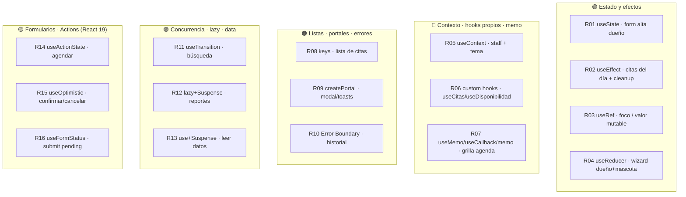

# 🐾 Lab React — Core & Hooks (pragmático)

## Sistema de Agenda de Visitas Veterinarias · *consola interna* · *personas · mascotas · citas*

> **Formato:** consigna / letra del problema. Acá está el **qué** y el **por qué**, no la solución.
> Cada requerimiento fija la **capacidad de React obligatoria** que tenés que usar para resolverlo.
> **Twin** del *Lab Next.js — Estrategias de Renderizado*: mismo dominio, mismas convenciones. Acá el eje es el **core de React** (client-only).
> **Stack objetivo:** Vite + **React 19.x** (mínimo `^19`, probado con 19.2) + TypeScript strict.

---

## 0. Contexto y objetivos

Vas a construir la **consola interna** de una clínica veterinaria como **SPA de React**. Cada feature está diseñada para forzarte a usar una capacidad concreta del core — pero **solo las que usás de verdad en producción**.

Al terminar vas a poder:

- Usar en features reales los hooks que tocás a diario: `useState`, `useEffect`, `useRef`, `useReducer`, `useContext`, `useMemo`/`useCallback`/`memo`, `useTransition`, `use`, y las **Actions** de React 19 (`useActionState`, `useOptimistic`, `useFormStatus`) + **custom hooks**.
- Aplicar **Suspense**, **Error Boundaries**, **lazy/code-splitting**, **portals**, **keys/reconciliación** y el manejo correcto de **efectos** (dependencias, cleanup, idempotencia).
- Diseñar estilos **100% CSS Modules** sobre **design tokens** globales.
- Modelar el acceso a datos detrás de un **mock API que devuelve Promises**, para que Suspense y `use()` tengan contra qué suspender.

> **Alcance deliberadamente pragmático.** Este lab deja **afuera** los hooks de nicho que casi nunca escribís a mano — `useImperativeHandle`/`forwardRef`, `useDeferredValue`, `useSyncExternalStore`, `useLayoutEffect`, `useId`. Existen y está bien saber que existen, pero no son el foco de lo que un dev usa día a día.
> **Fuera de alcance (lo cubre el lab de Next):** renderizado del server, RSC, SSR/SSG/ISR, Route Handlers.

---


## 1. El dominio


### 1.1 Letra general del sistema

**VetLab** es la **consola operativa interna** del equipo de una clínica veterinaria de barrio (recepción y veterinarios): **los turnos los da de alta el staff** (por teléfono, mostrador o walk-in). Su objetivo central es simple de enunciar y rico en consecuencias: **coordinar el encuentro entre una mascota, su dueño y un veterinario, para un servicio puntual, en una fecha y hora, sin superposiciones, y conservando un historial coherente** de quién atendió qué y cuándo.

La clínica atiende con **agenda por veterinario**: cada profesional tiene sus horarios de atención y su especialidad, y los turnos se toman contra esa disponibilidad. Los servicios (consulta general, vacunación, cirugía, peluquería, control, ...) tienen una **duración** que determina cuánto ocupa cada turno en la agenda.

**Actores**

- **Recepción / staff** — el **usuario principal**: opera el día a día, da de alta turnos, confirma/completa/cancela, y registra dueños y mascotas nuevas.
- **Dueño y mascota** — **no** son usuarios del sistema: son **registros** que el staff administra (contacto, mascotas e historial de citas).
- **Admin / veterinario** — mantiene el catálogo (vets y servicios), que cambia rara vez.

**Journeys principales**

1. **Operación diaria** (staff): dashboard con los turnos de hoy → gestionar estados en el momento → alta de walk-ins.
2. **Reserva de turno** (staff): elegir dueño/mascota/vet/servicio → ver la disponibilidad del vet → confirmar el turno contra esa agenda, sin superposiciones.
3. **Gestión de dueños** (staff): registrar dueño + su primera mascota → buscar dueños → abrir perfil e historial.
4. **Mantenimiento de catálogo** (admin): editar un vet o un servicio → el cambio se refleja en las vistas internas.

**Alcance y supuestos** *(lo que te permite inferir el resto)*

- **Client-only:** en este lab no hay backend. Los datos viven en un **mock API en memoria** (sembrado) que **devuelve Promises con latencia simulada** — ver 6.2. Es lo que le da trabajo a Suspense, `use()` y a los estados de loading/error.
- **Zona horaria única**: America/Montevideo. Fechas como ISO, mostradas en hora local.
- **Volumen modesto** (clínica de barrio): decenas de registros, turnos del orden de decenas por día.
- **Ciclo de vida de la cita**: `pendiente` → `confirmada` → `completada`, o `cancelada` en cualquier punto previo. Una `cancelada` libera el slot; una `completada` es historia.
- **Identidad**: no hay auth real; asumí un "staff logueado" **stubbeado** que se comparte por context (R05).
- **Catálogo y precios** son de referencia interna; el lab no procesa pagos.

> **Cómo usar esta letra:** cuando un requerimiento no especifique un detalle (validaciones exactas, textos, qué mostrar en una card, cómo ordenar una lista), **inferí la decisión razonable a partir de este contexto y de los modelos de 1.3**, y documentá el supuesto.


### 1.2 Modelo de datos

```mermaid
erDiagram
    OWNER ||--o{ PET : "tiene"
    OWNER ||--o{ APPOINTMENT : "agenda"
    PET ||--o{ APPOINTMENT : "asiste a"
    VET ||--o{ APPOINTMENT : "atiende"
    SERVICE ||--o{ APPOINTMENT : "corresponde a"

    OWNER { string id; string nombre; string apellido; string email; string telefono; string createdAt }
    PET { string id; string ownerId; string nombre; string especie; string raza; number pesoKg }
    VET { string id; string nombre; string especialidad; object horarios }
    SERVICE { string id; string slug; string nombre; number duracionMin; number precio }
    APPOINTMENT { string id; string ownerId; string petId; string vetId; string serviceId; string fechaHora; string estado }
```


### 1.3 Modelos de las entidades

Como el lab es **client-only**, los ids son `string` y las fechas se manejan como **ISO string**.

```ts
// src/domain/models.ts
export type Especie = "perro" | "gato" | "ave" | "roedor" | "reptil" | "otro";
export type EstadoCita = "pendiente" | "confirmada" | "completada" | "cancelada";
export type DiaSemana = "lun" | "mar" | "mie" | "jue" | "vie" | "sab" | "dom";

export interface FranjaHoraria { desde: string; hasta: string; } // "HH:mm"
export type Horarios = Partial<Record<DiaSemana, FranjaHoraria[]>>;

export interface Owner {
  id: string;
  nombre: string;
  apellido: string;
  email: string;          // único
  telefono: string;
  direccion?: string;
  createdAt: string;      // ISO
}

export interface Pet {
  id: string;
  ownerId: string;        // → Owner
  nombre: string;
  especie: Especie;
  raza?: string;
  fechaNacimiento?: string; // ISO
  pesoKg?: number;
  notas?: string;
}

export interface Vet {
  id: string;
  nombre: string;
  especialidad: string;
  bio?: string;
  fotoUrl?: string;
  horarios: Horarios;
}

export interface Service {
  id: string;
  slug: string;
  nombre: string;
  descripcion: string;
  duracionMin: number;
  precio: number;
  activo?: boolean;
}

export interface Appointment {
  id: string;
  ownerId: string;
  petId: string;
  vetId: string;
  serviceId: string;
  fechaHora: string;      // ISO, inicio del turno
  motivo?: string;
  estado: EstadoCita;
  notas?: string;
  createdAt: string;      // ISO
}
```

**Tipos derivados (UI y mock API):**

```ts
export interface Slot { inicio: string; fin: string; disponible: boolean; } // ISO

export interface AppointmentView
  extends Omit<Appointment, "ownerId" | "petId" | "vetId" | "serviceId"> {
  owner:   Pick<Owner, "id" | "nombre" | "apellido">;
  pet:     Pick<Pet, "id" | "nombre" | "especie">;
  vet:     Pick<Vet, "id" | "nombre" | "especialidad">;
  service: Pick<Service, "id" | "nombre" | "duracionMin">;
}

export type NewAppointmentInput = {
  ownerId: string; petId: string; vetId: string; serviceId: string;
  fechaHora: string; motivo?: string;
};
```


### 1.4 Reglas de negocio

- `estado ∈ { "pendiente", "confirmada", "completada", "cancelada" }`.
- Una cita ocupa el tramo `[fechaHora, fechaHora + service.duracionMin)` en la agenda de ese `vetId`.
- **No pueden solaparse** dos citas activas (no canceladas) del mismo veterinario.
- La **disponibilidad** de un vet en un día = sus `horarios` − los tramos ocupados por citas activas.
- Una mascota siempre pertenece a un dueño (`pet.ownerId` obligatorio).

---


## 2. Stack requerido

- **Vite + React 19.x** (mínimo `^19`, probado con 19.2) + **TypeScript** en modo `strict`. Prohibido `any`.
- Router a elección (React Router o uno propio).
- **Estilos:** ver sección 3 (restricción dura).
- **Datos:** el **mock API** de 6.2 (Promises en memoria). **No** traigas una librería de estado global (Redux/Zustand): la idea es ejercitar el core.
- ESLint + Prettier configurados. `README.md` con setup + versión de React.

> **APIs que son React 19-only** (instalá 19, no 18): `use` *(R13)*, `useActionState`/`useOptimistic`/`useFormStatus` *(R14–R16)*, y `ref` como prop común *(R09)*.

---


## 3. Restricciones de estilos  ⚠️ *lectura obligatoria*

> Restricción **dura** del lab y parte del checklist.

1. **Solo CSS Modules.** Toda regla vive en `*.module.css` co-ubicado con su componente. Prohibido: Tailwind/utility frameworks, CSS-in-JS (styled-components, emotion, `style={{}}` salvo valores calculados en runtime como la posición de un evento en el calendario), y librerías de componentes con estilos propios (MUI, Chakra, etc.).
2. **Estilos globales con tokens.** Un único `src/styles/tokens.css` declara los **design tokens** como CSS custom properties en `:root`. Ese archivo se limita a reset mínimo + tokens + base de `html/body`.
3. **Los CSS Modules NO hardcodean valores.** Colores, espaciados, radios, tipografías, sombras: **siempre** vía `var(--token)`.
4. **Theming (R18):** tema claro/oscuro con `[data-theme="dark"]` **sin tocar los CSS Modules** (solo redefiniendo tokens).


### `tokens.css` provisto (punto de partida)

```css
/* src/styles/tokens.css — ANDAMIAJE PROVISTO */
:root {
  /* Brand */
  --color-primary-50:#e6f7f4; --color-primary-100:#b9ebe3; --color-primary-300:#57c9b6;
  --color-primary-500:#12a594; --color-primary-600:#0e857a; --color-primary-700:#0b6960;
  --color-accent-500:#f4a259;
  /* Semantic */
  --color-success:#2e9e5b; --color-warning:#d99a0b; --color-danger:#d64545; --color-info:#3b82f6;
  /* Neutrals / surfaces */
  --color-bg:#f7faf9; --color-surface:#ffffff; --color-border:#e2e8e6;
  --color-text:#1a2b28; --color-text-soft:#55635f; --color-text-mute:#8a9691;
  /* Spacing (4px) */
  --space-1:0.25rem; --space-2:0.5rem; --space-3:0.75rem; --space-4:1rem;
  --space-5:1.5rem; --space-6:2rem; --space-8:3rem; --space-10:4rem;
  /* Radii */
  --radius-sm:4px; --radius-md:8px; --radius-lg:16px; --radius-full:999px;
  /* Typography */
  --font-sans:system-ui,-apple-system,"Segoe UI",Roboto,sans-serif;
  --font-mono:"JetBrains Mono",ui-monospace,monospace;
  --fs-xs:0.75rem; --fs-sm:0.875rem; --fs-md:1rem; --fs-lg:1.25rem; --fs-xl:1.75rem; --fs-2xl:2.5rem;
  --lh-tight:1.2; --lh-base:1.55;
  /* Elevation */
  --shadow-sm:0 1px 2px rgba(16,40,36,.06); --shadow-md:0 4px 12px rgba(16,40,36,.10); --shadow-lg:0 12px 32px rgba(16,40,36,.14);
  /* Layout & z */
  --container-max:1120px; --z-modal:1000; --z-toast:1100;
  /* Motion */
  --transition-fast:120ms ease; --transition-base:200ms ease;
}

[data-theme="dark"] {
  --color-bg:#0f1615; --color-surface:#16211f; --color-border:#26332f;
  --color-text:#eaf1ef; --color-text-soft:#a7b4b0; --color-text-mute:#6f7c78;
}

* { box-sizing: border-box; }
html, body { margin: 0; padding: 0; }
body { background: var(--color-bg); color: var(--color-text); font-family: var(--font-sans); font-size: var(--fs-md); line-height: var(--lh-base); }
```

**Convención de módulos:** un module por componente (`Card.tsx` + `Card.module.css`), clases en `camelCase`, compuestas con `clsx`/template strings.

---


## 4. Mapa de capacidades → features




---


## 5. Requerimientos funcionales

> Cada card tiene: **Contexto** (la letra), **Feature/Vista**, **Capacidad obligatoria**, **Qué construir**, **Criterios de aceptación**, **Hints** y **Gotchas**. La capacidad obligatoria **no es negociable**.

---


### 🟢 Track A — Estado y efectos


#### R01 — Alta de dueño (form controlado)

**Contexto.** Cuando entra un dueño nuevo al mostrador, la recepcionista necesita cargarlo rápido y sin errores: un email mal tipeado hoy es un turno que mañana no se puede confirmar. Este form es la puerta de entrada de toda persona al sistema, así que el tipeo tiene que sentirse inmediato — cada tecla se refleja al instante y los errores se marcan *mientras* escribe, no recién al apretar "Guardar". Es el caso más puro de estado local de UI: el valor de cada campo vive en el componente, React re-renderiza en cada cambio, y la validez es algo que se *deriva* de esos valores, no un estado aparte que haya que mantener sincronizado. Dominar bien esa distinción (qué es estado y qué es derivado) es la base de todo lo demás.

- **Feature:** vista/dialog "Nuevo dueño".
- **Capacidad obligatoria:** `useState` (componentes controlados).
- **Qué construir:** form con inputs controlados (nombre, apellido, email, teléfono, dirección) y validación en vivo (email válido, requeridos), con feedback por campo.
- **Criterios de aceptación:**
  - [ ] Cada input es controlado (valor + `onChange` en estado).
  - [ ] La validación reacciona a cada cambio; el submit se deshabilita si hay errores.
- **Hints:** un solo objeto `form` o un `useState` por campo — elegí y justificá. Derivá los errores del estado (no dupliques estado de "hay error").
- **Gotchas:** no guardes en estado lo que podés **derivar** en el render (ej. `isValid`).


#### R02 — Citas del día (carga + cleanup)

**Contexto.** El dashboard es lo primero que la recepción abre a la mañana: "qué tenemos hoy". Al montarse tiene que salir a buscar las citas del día al mock API y mostrarlas; y cuando cambia la fecha (ver mañana, o el sábado), tiene que volver a pedir. Acá aparece el problema clásico de los efectos: si pide para el martes, la recepcionista salta rápido al miércoles, y la respuesta del martes llega *después* — terminás pintando datos viejos. Por eso el effect necesita un cleanup que cancele o ignore la request anterior. Es el ejercicio para entender de verdad el ciclo montaje → dependencias → cleanup, y por qué el dependency array no es un detalle.

- **Feature:** dashboard de hoy.
- **Capacidad obligatoria:** `useEffect` (con cleanup).
- **Qué construir:** al montar (y al cambiar la fecha), pedí las citas del día; mostrá loading/estado. Cancelá la request anterior al cambiar de fecha o desmontar.
- **Criterios de aceptación:**
  - [ ] El effect declara correctamente sus dependencias (`date`).
  - [ ] Hay cleanup que evita el "set state after unmount"/race entre fechas.
- **Hints:** usá un flag `cancelled` o `AbortController` en el cleanup. (En R13 vas a ver la versión "sin useEffect" con `use()` + Suspense.)
- **Gotchas:** dependency array vacío cuando en realidad dependés de `date` = bug clásico de datos viejos.


#### R04 — Wizard "Alta dueño + primera mascota"

**Contexto.** Registrar a alguien por primera vez son en realidad dos altas encadenadas: primero la persona, después su primera mascota. Modelado como wizard de dos pasos, el estado se pone denso — en qué paso estás, los campos de cada paso, los errores, si podés avanzar. Con varios `useState` sueltos esto se vuelve un enredo de sincronización; con un reducer, cada cosa que puede pasar es una acción explícita (`SET_FIELD`, `NEXT`, `BACK`, `SUBMIT`, `ERROR`) y el estado siguiente es una función pura del anterior. Es el caso donde `useReducer` brilla: lógica de transición no trivial que querés centralizada, testeable y predecible.

- **Feature:** flujo de dos pasos (datos del dueño → datos de la mascota).
- **Capacidad obligatoria:** `useReducer`.
- **Qué construir:** manejá pasos, campos y errores del wizard con un reducer y acciones tipadas. Al confirmar, llamá `crearDuenoConMascota` del mock.
- **Criterios de aceptación:**
  - [ ] Todo el estado del wizard vive en un reducer con acciones tipadas (discriminated union).
  - [ ] Las transiciones de paso pasan por el reducer (no por `useState` sueltos).
- **Hints:** tipá `Action` como union discriminada; el reducer devuelve estado nuevo inmutable.
- **Gotchas:** no metas lógica async dentro del reducer; dispatchá el resultado.

---


### 🔵 Track B — Contexto, hooks propios, memoización


#### R05 — Staff logueado + tema (context)

**Contexto.** Hay dos datos que casi toda la app necesita pero que nadie quiere pasar por props a través de diez niveles: quién es el staff que está usando la consola (para el saludo en la topbar y, a futuro, permisos) y el tema visual elegido. Son el ejemplo de manual de "estado global liviano y de lectura frecuente": se definen una vez arriba y se consumen donde haga falta. La topbar saluda al staff y ofrece el toggle de tema; el resto de la app lee el tema para pintarse. El objetivo es usar context *bien* — proveerlo en la raíz, consumirlo con un hook propio, y no caer en el re-render de todos los consumidores por recrear el `value` en cada render.

- **Feature:** topbar + layout general.
- **Capacidad obligatoria:** `useContext` **+** `createContext`.
- **Qué construir:** un `SessionContext` (staff stubbeado) y un `ThemeContext` (claro/oscuro) provistos en la raíz y consumidos en la topbar.
- **Criterios de aceptación:**
  - [ ] Provider en la raíz + consumo vía `useContext` en hijos.
  - [ ] Cambiar el tema desde el context afecta a toda la app (se enlaza con R18).
- **Hints:** exponé un hook `useSession()`/`useTheme()` que encapsule el `useContext` y tire error si falta el provider.
- **Gotchas:** un context cuyo `value` se recrea en cada render re-renderiza a todos los consumidores; memozá el value.


#### R06 — Hooks de datos reutilizables

**Contexto.** La agenda y el dashboard necesitan más o menos lo mismo: pedir citas o disponibilidad, manejar loading, error y un refetch. Copiar ese bloque en cada vista es la receta para que se desincronicen y para que un fix quede en una y no en la otra. La idea es destilar esa lógica en hooks propios — `useCitas(date)`, `useDisponibilidad(vetId, date)` — que devuelvan una API limpia y tipada, y usarlos en más de un lado. Es el ejercicio de *composición*: los custom hooks son la unidad de reutilización de lógica en React, y hacer uno bueno (con sus deps, su refetch, su tipado) es lo que separa un código que escala de uno que se pudre.

- **Feature:** agenda y dashboard comparten lógica de fetch.
- **Capacidad obligatoria:** **Custom hooks**.
- **Qué construir:** `useCitas(date)` y `useDisponibilidad(vetId, date)` que encapsulen la llamada al mock + estado (`data`, `loading`, `error`, `refetch`). Reusalos en más de una vista.
- **Criterios de aceptación:**
  - [ ] La lógica de datos vive en hooks reutilizables, no copypasteada.
  - [ ] Los hooks exponen una API clara y tipada.
- **Hints:** internamente pueden usar `useEffect` + `useState` (o envolver `use()` de R13). Devolvé `refetch` para invalidar tras mutaciones.
- **Gotchas:** cuidá las deps del effect interno (`date`, `vetId`) para no quedar con datos viejos.


#### R07 — Grilla de agenda performante

**Contexto.** La grilla de la agenda puede tener muchísimas celdas (slots por hora, por vet). Cada vez que la recepcionista filtra por veterinario o cambia de día, si no tenés cuidado se re-renderiza toda la grilla y se siente lento. Este requerimiento es sobre *performance medida*: memozar el cálculo de disponibilidad con `useMemo`, envolver la celda en `memo` para que no se repinte si sus props no cambiaron, y pasar callbacks estables con `useCallback` para que ese `memo` sirva de algo. El punto pedagógico es que las tres piezas trabajan juntas — y que la memoización sin medir es cargo cult: tenés que demostrar la mejora con el Profiler.

- **Feature:** calendario/grilla de slots.
- **Capacidad obligatoria:** `useMemo` **+** `useCallback` **+** `memo`.
- **Qué construir:** memozá el cálculo de disponibilidad, envolvé la celda en `memo`, y pasá handlers estables con `useCallback` para que reordenar/filtrar no re-renderice todo.
- **Criterios de aceptación:**
  - [ ] Las celdas memozadas no re-renderizan ante props no relacionadas (verificable con el Profiler).
  - [ ] Los cálculos costosos están detrás de `useMemo` con deps correctas.
- **Hints:** medí antes/después con React DevTools Profiler; `memo` solo sirve si las props son estables → de ahí `useCallback`.
- **Gotchas:** memoización prematura o mal-deps es peor que nada; justificá dónde aplica.

---


### 🟠 Track C — Listas, portales, errores


#### R08 — Lista de citas filtrable

**Contexto.** La lista de citas se filtra y se reordena todo el tiempo (por estado, por hora, por vet). Si a cada item le das como key su posición en el array, React se confunde cuando la lista cambia de orden: reusa el DOM equivocado y, si cada fila tiene estado propio (un input, un menú abierto), ese estado "salta" a la cita de al lado. Este requerimiento te pide usar keys estables por identidad (`id`) y, sobre todo, *mostrar el bug* del índice con un ejemplo reproducible, para que quede grabado por qué la reconciliación depende de la key. Es uno de esos errores que todos cometemos una vez y no volvemos a cometer.

- **Feature:** listado de citas (dashboard/perfil).
- **Capacidad obligatoria:** **keys y reconciliación**.
- **Qué construir:** lista filtrable/ordenable con keys estables por `id`. Documentá con un ejemplo reproducible el bug de usar el índice como key.
- **Criterios de aceptación:**
  - [ ] Keys estables por identidad; sin `key={index}` en listas mutables.
  - [ ] Mostrás/explicás el bug del índice y cómo la key correcta lo arregla.
- **Hints:** poné un input o estado local por item para evidenciar la reconciliación.
- **Gotchas:** una key que cambia en cada render (ej. `Math.random()`) destruye y recrea el subárbol (pierde foco/estado).


#### R09 — Portales para modal y toasts

**Contexto.** Un modal que abre "dentro" de la card de una cita hereda sus límites: lo recorta el overflow, lo tapan otros elementos, el z-index pelea con medio layout. Lo mismo con los toasts, que deberían aparecer flotando sobre todo sin importar desde dónde se dispararon. La solución es renderizarlos en un nodo aparte del DOM (`#modal-root`, `#toast-root`) manteniéndolos dentro del árbol de React. Este requerimiento es sobre `createPortal`: entender que podés desacoplar *dónde vive el DOM* de *dónde vive el componente*, conservando context y eventos — y que la accesibilidad (trap de foco, cerrar con Escape) queda de tu lado.

- **Feature:** modal de detalle de cita + toasts.
- **Capacidad obligatoria:** `createPortal`.
- **Qué construir:** renderizá el modal y los toasts en un portal a `#modal-root` / `#toast-root` fuera del árbol de la vista, manejando foco y `Escape`.
- **Criterios de aceptación:**
  - [ ] El contenido se monta en un nodo DOM fuera del contenedor de la vista.
  - [ ] El overlay funciona por encima de todo (usá `--z-modal`).
- **Hints:** el portal mantiene el árbol de React (context/eventos) aunque el DOM esté afuera.
- **Gotchas:** accesibilidad — trap de foco y cierre por teclado no vienen gratis.

---


### 🟣 Track D — Concurrencia, code-splitting, data con Suspense


#### R11 — Búsqueda sin bloquear (transición)

**Contexto.** El buscador de dueños tiene que sentirse instantáneo mientras se tipea, aunque debajo esté filtrando una lista grande. El problema es que, por defecto, React trata todos los updates como urgentes: si el filtrado es pesado, cada tecla se traba. `useTransition` te deja decirle "esto que estoy tipeando es urgente, pero el re-filtrado de la lista puede esperar y quedar en segundo plano". Este requerimiento es sobre marcar ese trabajo como transición y mostrar un `isPending` mientras la lista se pone al día, sin sacrificar la fluidez del input. La sutileza clave: el valor del input se actualiza urgente; *solo* el trabajo derivado va en la transición.

- **Feature:** buscador de dueños.
- **Capacidad obligatoria:** `useTransition`.
- **Qué construir:** al tipear, filtrar la lista marcando el filtrado como **transición**; mostrá `isPending` manteniendo el input fluido.
- **Criterios de aceptación:**
  - [ ] El input nunca se traba aunque el filtrado sea costoso.
  - [ ] Se muestra estado `pending` durante la transición.
- **Hints:** `const [isPending, startTransition] = useTransition()`; envolvé el `setState` del filtro. Su primo `useDeferredValue` resuelve lo mismo cuando *recibís* un valor que no controlás (por prop) en vez de controlar el update — tenelo en el radar, pero acá va `useTransition`.
- **Gotchas:** no envuelvas en transición el update del **valor del input** (ese es urgente); solo el trabajo derivado.


#### R12 — Vista pesada con code-splitting

**Contexto.** La vista de Reportes/Estadísticas es grande y cara (gráficos, agregaciones) pero se usa poco: no tiene sentido que su código pese en el arranque de la consola, donde lo que importa es abrir el dashboard rápido. Este requerimiento te pide cargarla bajo demanda con `React.lazy`, de modo que su bundle sea un chunk aparte que se descarga solo cuando la recepcionista entra a Reportes, con un `<Suspense fallback>` mientras llega. Es el ejercicio de code-splitting: entender cómo `lazy` + Suspense parten la app en pedazos que cargan cuando hacen falta, y verificar en el build que efectivamente se generó el chunk separado.

- **Feature:** "Reportes"/"Estadísticas".
- **Capacidad obligatoria:** `lazy` **+** `Suspense`.
- **Qué construir:** cargá la vista pesada con `React.lazy` y envolvela en `<Suspense fallback>`; se descarga solo al entrar.
- **Criterios de aceptación:**
  - [ ] El bundle de esa vista es un chunk separado (verificable en el build).
  - [ ] Hay fallback mientras carga.
- **Hints:** `const Reportes = lazy(() => import('./Reportes'))`.
- **Gotchas:** un default export es lo que `lazy` espera; nombralo bien.


#### R13 — Leer datos con `use()` + Suspense

**Contexto.** En R02 cargaste datos "a mano" con `useEffect` + estados de loading. Acá hacés lo mismo pero al estilo React moderno: el perfil del dueño lee sus mascotas y su historial tomando directamente la Promise del mock con el hook `use()`, y el "cargando" lo maneja Suspense por vos — sin variable de loading, sin `useEffect`. Separás mascotas e historial en dos boundaries para que cada uno resuelva por su cuenta (uno rápido, otro lento). El gran cuidado, y el corazón del ejercicio, es la *estabilidad de la Promise*: si creás una promesa nueva en cada render, Suspense entra en loop; el mock tiene que memozarla por clave. Es el nuevo modelo mental de data-fetching en React.

- **Feature:** perfil del dueño (mascotas + historial).
- **Capacidad obligatoria:** `use` **+** `Suspense`.
- **Qué construir:** leé la Promise del mock con `use()` dentro de un componente hijo y envolvelo en `<Suspense fallback={<Skeleton/>}>`. Separá "mascotas" e "historial" en dos boundaries independientes.
- **Criterios de aceptación:**
  - [ ] Los datos se leen con `use(promise)`; el loading lo maneja Suspense (sin loading manual).
  - [ ] Cada sección suspende y resuelve por separado.
- **Hints:** estabilizá la Promise (no crear una nueva en cada render) — el mock debe memozar por clave. Combinalo con el Error Boundary de R10.
- **Gotchas:** crear la Promise en el render sin cache = loop infinito de suspensión.

---


### 🟡 Track E — Formularios y Actions (React 19)


#### R14 — Agendar cita (action)

**Contexto.** Agendar una cita es la operación central de la consola. El form manda dueño, mascota, vet, servicio y horario, y el sistema tiene que validar que el slot esté libre (regla de solapamiento de 1.4) antes de confirmar. Este requerimiento te pide resolverlo con el modelo de Actions de React 19: `useActionState` maneja el submit, el pending, los errores de validación que vuelven al form, y el reset al éxito — todo sin el clásico enredo de tres `useState` para loading + errores + éxito. La validación de disponibilidad vive en la action, del lado "server" (acá, el mock). Es el patrón nuevo para forms que mutan datos, y la base de R15 y R16.

- **Feature:** form de nueva cita.
- **Capacidad obligatoria:** `useActionState`.
- **Qué construir:** el submit dispara una **action** que valida (slot libre) y llama al mock; el hook maneja estado/errores/resultado y resetea al éxito.
- **Criterios de aceptación:**
  - [ ] El form usa una action con `useActionState` (no un `onSubmit` manual con `useState` de loading/errores).
  - [ ] Los errores de validación vuelven al form desde el estado de la action.
- **Hints:** `const [state, formAction, isPending] = useActionState(action, initial)`. Validá disponibilidad en la action.
- **Gotchas:** manejá el pending y el doble-submit; la action es async, no bloquea el hilo.


#### R15 — Confirmar / cancelar con UI optimista

**Contexto.** En el dashboard, la recepcionista confirma o cancela citas todo el tiempo; esperar el "ida y vuelta" para cada click se siente lento. Con `useOptimistic`, la cita cambia de estado *al instante* en la UI mientras la action corre por detrás, y si algo falla, revierte sola al estado anterior. Este requerimiento te pide justamente eso — feedback inmediato con rollback — apoyándote en la action de R14. Para probarlo de verdad, el mock puede fallar aleatoriamente, así ves el rollback en acción. La lección: el estado optimista es una ilusión temporal; sin buen manejo de error, mostrás algo que nunca pasó.

- **Feature:** acciones de estado sobre una cita.
- **Capacidad obligatoria:** `useOptimistic`.
- **Qué construir:** cambiar `estado` (confirmar/completar/cancelar) actualizando la UI **al instante**; si la action falla, **rollback**.
- **Criterios de aceptación:**
  - [ ] La UI refleja el cambio antes de que resuelva la action y se reconcilia con el resultado real.
  - [ ] Ante error, revierte al estado previo.
- **Hints:** `useOptimistic` + la action de R14; el mock puede fallar aleatoriamente para probar el rollback.
- **Gotchas:** el estado optimista es efímero; sin manejo de error quedás mostrando algo que no persistió.


#### R16 — Botón submit con pending

**Contexto.** Todo form-action necesita un botón que se deshabilite y muestre un spinner mientras la action corre. Podrías pasarle el `pending` por prop, pero React 19 tiene algo más elegante: `useFormStatus` deja que un botón *hijo* de un `<form>` lea el estado de envío directamente, sin prop drilling. Este requerimiento te pide construir un `<SubmitButton>` reutilizable que se entere solo de si su form está enviando. Es chiquito pero enseña un concepto importante: hay estado que "fluye hacia abajo" por el contexto del form, no por props. El gotcha central: el hook solo funciona en un componente *por debajo* del `<form>`, no en el que lo renderiza.

- **Feature:** el botón de cualquier form-action.
- **Capacidad obligatoria:** `useFormStatus`.
- **Qué construir:** un `<SubmitButton>` que lee el estado `pending` **desde adentro del form** (subcomponente), sin recibirlo por props.
- **Criterios de aceptación:**
  - [ ] El botón obtiene `pending` vía `useFormStatus` (no por prop drilling).
  - [ ] Deshabilita y muestra spinner mientras la action corre.
- **Hints:** `useFormStatus` solo funciona en un componente **hijo** de un `<form>` con action.
- **Gotchas:** llamarlo en el mismo componente que renderiza el `<form>` no funciona; tiene que estar por debajo.

---

## 6. Andamiaje (*scaffolding*)

> Infraestructura **dada**: no es lo que se evalúa.


### 6.1 Estructura sugerida

```
src/
  main.tsx                     # <StrictMode> + providers (R05/R17)
  App.tsx                      # router / vistas
  styles/tokens.css            # tokens (sección 3)
  domain/models.ts             # tipos (sección 1.3)
  data/
    mockApi.ts                 # mock API en memoria (6.2)
    seed.ts                    # datos sembrados
  hooks/
    useCitas.ts                # R06
    useDisponibilidad.ts       # R06
  context/
    SessionContext.tsx         # R05
    ThemeContext.tsx           # R05 / R18
  components/
    Modal.tsx / Modal.module.css   # R09 (portal)
    Toasts.tsx                     # R09 (portal)
    ErrorBoundary.tsx              # R10
    SubmitButton.tsx               # R16
  views/
    Dashboard.tsx              # R02 / R08
    Agenda.tsx                 # R07
    Duenos.tsx                 # R11
    DuenoPerfil.tsx            # R13 / R10
    NuevoDueno.tsx             # R01 / R04
    NuevaCita.tsx              # R14 / R15 / R16
    Reportes.tsx               # R12 (lazy)
```


### 6.2 Mock API (spec — devuelve Promises)

Implementá un módulo en memoria con **latencia simulada** y **memoización de Promises por clave** (para que `use()`/Suspense no entren en loop):

```ts
// src/data/mockApi.ts — spec del andamiaje (implementación a tu cargo)
import type {
  Owner, Pet, Vet, Service, Appointment,
  AppointmentView, Slot, EstadoCita, NewAppointmentInput,
} from "../domain/models";

export interface VetApi {
  getCitasDelDia(dateISO: string): Promise<AppointmentView[]>;
  getDuenos(q?: string): Promise<Owner[]>;
  getDueno(id: string): Promise<Owner>;
  getMascotasDeDueno(ownerId: string): Promise<Pet[]>;
  getHistorialCitas(ownerId: string): Promise<AppointmentView[]>;
  getVets(): Promise<Vet[]>;
  getServicios(): Promise<Service[]>;
  getDisponibilidad(vetId: string, dateISO: string): Promise<Slot[]>;

  crearCita(input: NewAppointmentInput): Promise<Appointment>;         // valida solapamiento
  cambiarEstadoCita(id: string, estado: EstadoCita): Promise<Appointment>;
  crearDuenoConMascota(
    owner: Omit<Owner, "id" | "createdAt">,
    pet: Omit<Pet, "id" | "ownerId">,
  ): Promise<{ owner: Owner; pet: Pet }>;
}
```

- Sembrá ≥ 3 vets (con `horarios`), ≥ 4 servicios, ≥ 6 dueños, ≥ 8 mascotas y ≥ 20 citas (varias **hoy**).
- Para probar rollback (R15), permití que las mutaciones **fallen aleatoriamente** (flag configurable).

---


## 7. Entregables

1. **Repo** que corre (`npm run dev`) y buildea (`npm run build`).
2. `README.md` con setup paso a paso y la versión de React.
3. Documneto con las herramientas de IA utilizadas y prompts
4. Nota breve por requerimiento cuando hayas **inferido** un supuesto de la letra.

---


## 8. Checklist de autoevaluación

**Estado y efectos**

- [ ] `useState` — form de alta de dueño controlado, sin estado derivado duplicado. *(R01)*
- [ ] `useEffect` — citas del día con deps correctas y cleanup anti-race. *(R02)*
- [ ] `useRef` — foco + valor mutable sin re-render. *(R03)*
- [ ] `useReducer` — wizard dueño+mascota con acciones tipadas. *(R04)*

**Contexto · hooks · memo**

- [ ] `useContext` — sesión + tema en la raíz, value memozado. *(R05)*
- [ ] Custom hooks — `useCitas`/`useDisponibilidad` reutilizados. *(R06)*
- [ ] `useMemo`/`useCallback`/`memo` — grilla sin re-renders innecesarios (medido). *(R07)*

**Listas · portales · errores**

- [ ] Keys estables + demo del bug del índice. *(R08)*
- [ ] `createPortal` — modal/toasts fuera del árbol. *(R09)*
- [ ] Error Boundary — historial aislado con fallback+retry. *(R10)*

**Concurrencia · lazy · data**

- [ ] `useTransition` — búsqueda con `isPending`. *(R11)*
- [ ] `lazy` + `Suspense` — vista pesada en chunk aparte. *(R12)*
- [ ] `use` + `Suspense` — datos sin loading manual; Promise estable. *(R13)*

**Formularios · Actions**

- [ ] `useActionState` — agendar como action con errores. *(R14)*
- [ ] `useOptimistic` — confirmar/cancelar con rollback. *(R15)*
- [ ] `useFormStatus` — submit pending desde subcomponente. *(R16)*

**Estilos (transversal)**

- [ ] Solo CSS Modules; sin frameworks de CSS ni CSS-in-JS.
- [ ] Ningún color/spacing hardcodeado — todo `var(--token)`.
- [ ] `tokens.css` solo con reset + tokens + base.

**Bonus**

- [ ] `StrictMode` sin efectos rotos *(R17)* · Theming por tokens *(R18)*.

---


## 9. Recursos / docs

- Hooks (referencia): [https://react.dev/reference/react/hooks](https://react.dev/reference/react/hooks)
- `useState` / `useReducer`: [https://react.dev/reference/react/useReducer](https://react.dev/reference/react/useReducer)
- `useEffect` (y cuándo NO usarlo): [https://react.dev/learn/you-might-not-need-an-effect](https://react.dev/learn/you-might-not-need-an-effect)
- `useRef`: [https://react.dev/reference/react/useRef](https://react.dev/reference/react/useRef)
- `useContext`: [https://react.dev/reference/react/useContext](https://react.dev/reference/react/useContext)
- `useMemo` / `useCallback` / `memo`: [https://react.dev/reference/react/memo](https://react.dev/reference/react/memo)
- `useTransition`: [https://react.dev/reference/react/useTransition](https://react.dev/reference/react/useTransition)
- `lazy` + Suspense: [https://react.dev/reference/react/lazy](https://react.dev/reference/react/lazy)
- `use`: [https://react.dev/reference/react/use](https://react.dev/reference/react/use)
- Actions (`useActionState` / `useOptimistic` / `useFormStatus`): [https://react.dev/reference/react/useActionState](https://react.dev/reference/react/useActionState)
- Error Boundaries: [https://react.dev/reference/react/Component#catching-rendering-errors-with-an-error-boundary](https://react.dev/reference/react/Component#catching-rendering-errors-with-an-error-boundary)
- `createPortal`: [https://react.dev/reference/react-dom/createPortal](https://react.dev/reference/react-dom/createPortal)
- CSS Modules (Vite): [https://vitejs.dev/guide/features#css-modules](https://vitejs.dev/guide/features#css-modules)

